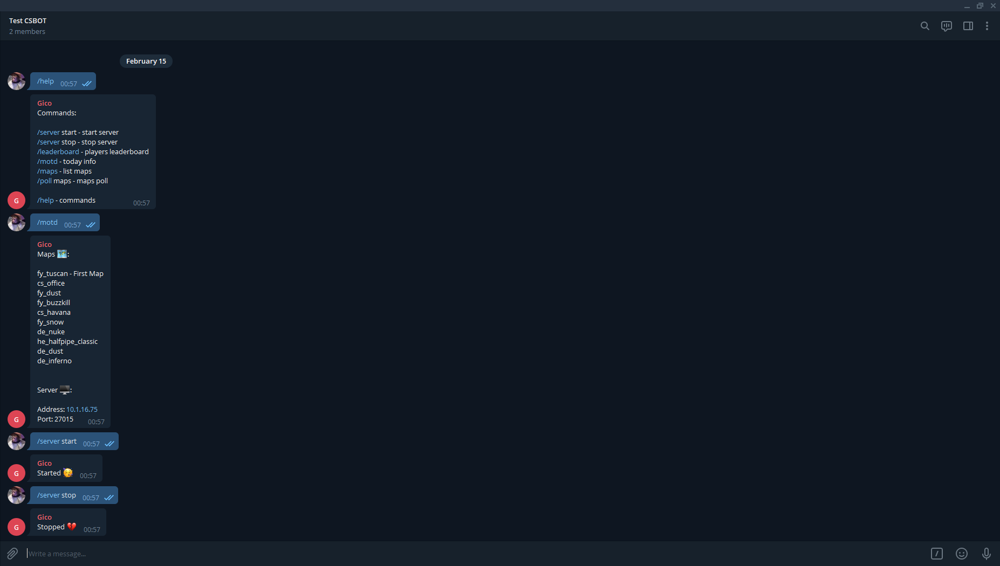

# CS16 Bot
Telegram bot for Counter-Strike 1.6 Server.

<p align="center">
  
</p>

# Features
* /server top - Top 10 players
* /server maps - List maps
* /server info - Server info
* /server start - Start server
* /server stop - Stop server
* /server address `address` - Change server address
* /server port `port` - Change server port
* /poll maps - Maps poll
* /cron start `expression` - Cron Job for auto start
* /cron stop `expression` - Cron Job for auto stop
* /cron pollmaps `expression` - Cron Job for auto map poll
* /help - Help

# Prerequisites
* [Node.js](https://nodejs.org/en/)

# Running
### 1. Configure
````
# Bot
Create and configure .env file like .env.example.

# HLDS
Set the '-console -game cstrike' parameters in the hlds.exe path to open as a console.
````

### 2. Telegram
````
# Create an Telegram bot
Find @BotFather on Telegram, type /newbot and follow the instructions.

# Username
Get your bot username and set 'TELEGRAM_USERNAME' in .env.

# Token
Get your token from @BotFather and set 'TELEGRAM_TOKEN' in .env.

# Create Group
Create Telegram group

# Add bot
Add bot as member

# Disable groups
Disable bot groups on @BotFather
````

### 3. Run
````
# Install dependencies
npm install

# Migrate
npm run migrate

# Seed
npm run seed

# Start
npm start
````

# Built With
* [Node.js](https://nodejs.org/en/)

# Authors
* [xxgicoxx](https://github.com/xxgicoxx/)

# Acknowledgments
* [FlatIcon](https://www.flaticon.com/)